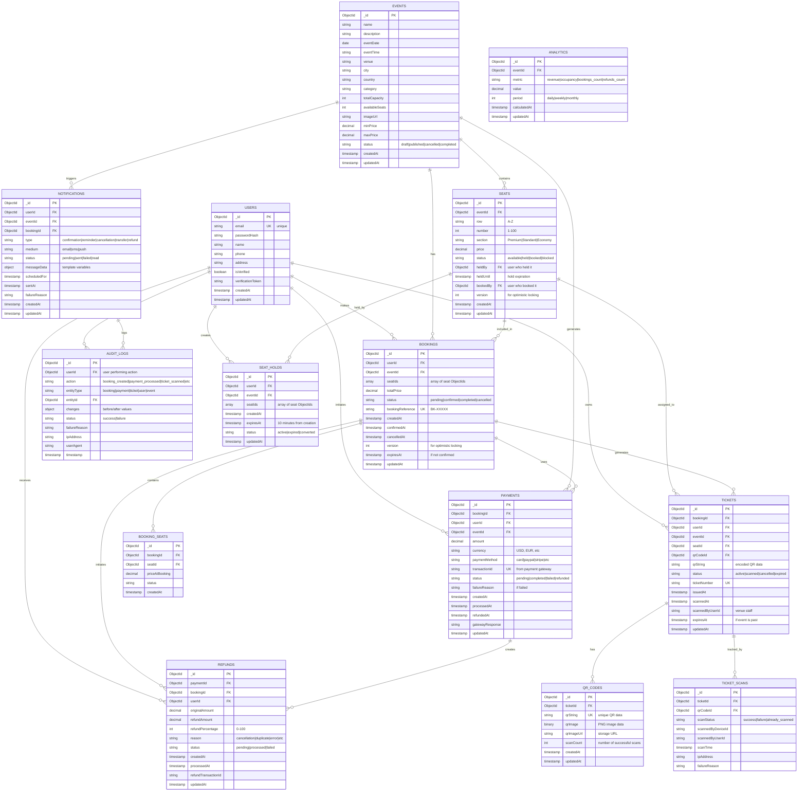

# ER Diagram - Event Ticketing System

## Entity-Relationship Diagram (Mermaid)



---

## Detailed Table Schemas

### USERS Collection

```javascript
{
  _id: ObjectId,
  email: String (unique, indexed),
  passwordHash: String,
  name: String,
  phone: String,
  address: {
    street: String,
    city: String,
    state: String,
    zipCode: String,
    country: String
  },
  isVerified: Boolean (default: false),
  verificationToken: String,
  resetPasswordToken: String,
  resetPasswordExpiry: Date,
  lastLoginAt: Date,
  loginCount: Number,
  role: String (enum: "user", "admin", "staff"),
  status: String (enum: "active", "suspended", "deleted"),
  preferences: {
    emailNotifications: Boolean,
    smsNotifications: Boolean,
    marketingEmails: Boolean,
    newsletter: Boolean
  },
  createdAt: Date,
  updatedAt: Date
}
```

**Indexes:**
- `email` (unique)
- `verificationToken`
- `resetPasswordToken`
- `createdAt`

---

### EVENTS Collection

```javascript
{
  _id: ObjectId,
  name: String (indexed),
  description: String,
  eventDate: Date (indexed),
  eventTime: String,
  venue: String (indexed),
  city: String (indexed),
  state: String,
  country: String,
  zipCode: String,
  category: String (enum: "concert", "theater", "sports", "comedy", "other"),
  subCategory: String,
  totalCapacity: Number,
  availableSeats: Number (denormalized, updated on each booking),
  imageUrl: String,
  bannerUrl: String,
  description: String,
  longDescription: String,
  pricing: {
    minPrice: Decimal128,
    maxPrice: Decimal128,
    currency: String (default: "USD")
  },
  organizer: {
    name: String,
    contact: String,
    email: String
  },
  status: String (enum: "draft", "published", "cancelled", "completed"),
  visibility: String (enum: "public", "private", "draft"),
  cancellationPolicy: {
    daysBeforeCancellation: Number (default: 14),
    refundPercentage: Number (default: 100) // percentage if cancelled
  },
  createdBy: ObjectId (FK to USERS),
  publishedAt: Date,
  cancelledAt: Date,
  createdAt: Date,
  updatedAt: Date
}
```

**Indexes:**
- `eventDate`
- `venue`
- `city`
- `category`
- `name`
- `status`

---

### SEATS Collection

```javascript
{
  _id: ObjectId,
  eventId: ObjectId (FK to EVENTS, indexed),
  row: String (A-Z),
  number: Number (1-500),
  section: String (enum: "Premium", "Standard", "Economy", custom sections),
  sectionId: ObjectId, // reference to seat section config
  price: Decimal128,
  accessibility: {
    isWheelchairAccessible: Boolean,
    hasCompanionSeat: Boolean
  },
  status: String (enum: "available", "held", "booked", "blocked"),
  heldBy: ObjectId (FK to USERS, nullable),
  heldUntil: Date (nullable),
  bookedBy: ObjectId (FK to USERS, nullable),
  bookingId: ObjectId (FK to BOOKINGS, nullable),
  version: Number (for optimistic locking, default: 0),
  createdAt: Date,
  updatedAt: Date
}
```

**Indexes:**
- `eventId, status` (compound, for quick availability queries)
- `eventId, row, number` (compound, unique per event)
- `heldUntil` (TTL index for automatic expiration)
- `bookedBy`

**Constraints:**
- Unique: (eventId, row, number)
- Check: price >= 0
- Check: row matches pattern [A-Z]

---

### SEAT_HOLDS Collection

```javascript
{
  _id: ObjectId,
  userId: ObjectId (FK to USERS, indexed),
  eventId: ObjectId (FK to EVENTS, indexed),
  seatIds: [ObjectId] (array of FK to SEATS),
  quantity: Number,
  totalPrice: Decimal128,
  status: String (enum: "active", "expired", "converted_to_booking"),
  createdAt: Date (indexed),
  expiresAt: Date (indexed, TTL: 600 seconds = 10 minutes),
  convertedToBookingId: ObjectId (FK to BOOKINGS, if converted),
  updatedAt: Date
}
```

**Indexes:**
- `userId, eventId`
- `expiresAt` (TTL index - documents auto-delete after 10 minutes)
- `status`

**TTL Index Configuration:**
```javascript
db.seat_holds.createIndex(
  { expiresAt: 1 },
  { expireAfterSeconds: 0 } // expire at exact timestamp
)
```

---

### BOOKINGS Collection

```javascript
{
  _id: ObjectId,
  userId: ObjectId (FK to USERS, indexed),
  eventId: ObjectId (FK to EVENTS, indexed),
  seatIds: [ObjectId] (array of FK to SEATS),
  quantity: Number,
  totalPrice: Decimal128,
  discount: Decimal128 (if applied),
  finalPrice: Decimal128,
  currency: String (default: "USD"),
  status: String (enum: "pending", "confirmed", "completed", "cancelled"),
  bookingReference: String (unique, indexed, e.g., "BK-202501181100123"),
  paymentId: ObjectId (FK to PAYMENTS, indexed),
  paymentStatus: String (denormalized from PAYMENTS for quick access),
  notes: String,
  version: Number (for optimistic locking, default: 0),
  createdAt: Date (indexed),
  confirmedAt: Date,
  completedAt: Date,
  cancelledAt: Date,
  expiresAt: Date (30 minutes if not confirmed, indexed),
  updatedAt: Date
}
```

**Indexes:**
- `userId`
- `eventId`
- `status`
- `bookingReference` (unique)
- `paymentId`
- `expiresAt` (for cleanup of expired pending bookings)
- `createdAt`

**Constraints:**
- Unique: `bookingReference`
- Check: `totalPrice >= 0`

---

### BOOKING_SEATS Collection

```javascript
{
  _id: ObjectId,
  bookingId: ObjectId (FK to BOOKINGS, indexed),
  seatId: ObjectId (FK to SEATS, indexed),
  priceAtBooking: Decimal128,
  status: String (enum: "confirmed", "cancelled"),
  createdAt: Date
}
```

**Indexes:**
- `bookingId`
- `seatId`
- `bookingId, seatId` (compound)

---

### PAYMENTS Collection

```javascript
{
  _id: ObjectId,
  bookingId: ObjectId (FK to BOOKINGS, indexed),
  userId: ObjectId (FK to USERS, indexed),
  eventId: ObjectId (FK to EVENTS),
  amount: Decimal128,
  currency: String (default: "USD"),
  paymentMethod: String (enum: "credit_card", "debit_card", "paypal", "stripe", "mock"),
  transactionId: String (unique, indexed, from payment gateway),
  status: String (enum: "pending", "completed", "failed", "refunded", "partially_refunded"),
  failureReason: String (if status = "failed"),
  failureCode: String,
  gatewayResponse: Object, // full response from payment gateway
  gatewayName: String, // which payment gateway processed this
  cardLast4: String, // last 4 digits of card (masked)
  cardBrand: String, // Visa, Mastercard, Amex, etc.
  
  // For retries
  attemptCount: Number (default: 1),
  maxAttempts: Number (default: 3),
  nextRetryAt: Date (nullable),
  
  // For refunds
  refundedAmount: Decimal128 (default: 0),
  refundTransactionId: String (if refunded),
  
  createdAt: Date (indexed),
  processedAt: Date,
  refundedAt: Date,
  updatedAt: Date
}
```

**Indexes:**
- `bookingId`
- `userId`
- `transactionId` (unique)
- `status`
- `createdAt`

---

### REFUNDS Collection

```javascript
{
  _id: ObjectId,
  paymentId: ObjectId (FK to PAYMENTS, indexed),
  bookingId: ObjectId (FK to BOOKINGS, indexed),
  userId: ObjectId (FK to USERS, indexed),
  originalAmount: Decimal128,
  refundAmount: Decimal128,
  refundPercentage: Number (0-100, e.g., 100 for full, 50 for half),
  reason: String (enum: "user_requested", "event_cancelled", "duplicate_charge", "system_error"),
  refundPolicy: String, // which policy applied
  status: String (enum: "pending", "processed", "failed", "reversed"),
  failureReason: String (if status = "failed"),
  
  refundTransactionId: String (unique, indexed, from payment gateway),
  gatewayResponse: Object,
  
  requestedBy: ObjectId (FK to USERS, user who requested refund),
  approvedBy: ObjectId (FK to USERS, admin who approved, if manual),
  
  processingNotes: String,
  
  createdAt: Date (indexed),
  processedAt: Date,
  updatedAt: Date
}
```

**Indexes:**
- `paymentId`
- `bookingId`
- `userId`
- `status`
- `refundTransactionId` (unique)

---

### TICKETS Collection

```javascript
{
  _id: ObjectId,
  bookingId: ObjectId (FK to BOOKINGS, indexed),
  userId: ObjectId (FK to USERS, indexed),
  eventId: ObjectId (FK to EVENTS, indexed),
  seatId: ObjectId (FK to SEATS, indexed),
  qrCodeId: ObjectId (FK to QR_CODES, indexed),
  qrString: String (encoded QR data),
  ticketNumber: String (unique, indexed, e.g., "TKT-202501181100001"),
  
  status: String (enum: "active", "scanned", "cancelled", "expired"),
  
  // Ticket details
  eventName: String (denormalized for quick access),
  eventDate: Date,
  eventTime: String,
  seatInfo: {
    row: String,
    number: Number,
    section: String,
    price: Decimal128
  },
  
  // Scanning/Validation
  isScanned: Boolean (default: false),
  scannedAt: Date (nullable),
  scannedByUserId: ObjectId (FK to USERS, venue staff who scanned),
  scanLocation: String, // gate ID, etc.
  
  // Expiration
  expiresAt: Date (if event is past),
  
  // Download tracking
  downloadedAt: Date (first download),
  downloadCount: Number (default: 0),
  
  issuedAt: Date,
  createdAt: Date,
  updatedAt: Date
}
```

**Indexes:**
- `bookingId`
- `userId`
- `eventId`
- `seatId`
- `qrCodeId`
- `ticketNumber` (unique)
- `status`
- `qrString` (for quick lookup during scanning)

---

### QR_CODES Collection

```javascript
{
  _id: ObjectId,
  ticketId: ObjectId (FK to TICKETS, indexed),
  qrString: String (unique, indexed, encoded QR data),
  qrImage: Binary (PNG image buffer, optional - store in file system instead),
  qrImageUrl: String, // URL to image stored in S3/CDN
  
  // QR data contains:
  // {
  //   bookingId: "BK-XXXXX",
  //   userId: "ObjectId",
  //   eventId: "ObjectId",
  //   seatId: "ObjectId",
  //   issuedAt: "ISO timestamp",
  //   signature: "hash for verification"
  // }
  
  version: Number, // QR code version (1-40)
  errorCorrectionLevel: String, // L, M, Q, H
  
  scanCount: Number (default: 0),
  lastScannedAt: Date,
  
  isValid: Boolean (default: true),
  invalidatedAt: Date (if ticket cancelled),
  invalidationReason: String,
  
  createdAt: Date,
  updatedAt: Date
}
```

**Indexes:**
- `ticketId`
- `qrString` (unique)
- `isValid`

---

### TICKET_SCANS Collection

```javascript
{
  _id: ObjectId,
  ticketId: ObjectId (FK to TICKETS, indexed),
  qrCodeId: ObjectId (FK to QR_CODES, indexed),
  
  scanStatus: String (enum: "success", "already_scanned", "ticket_expired", "invalid_qr"),
  
  scannedAt: Date (indexed),
  scannedByDeviceId: String, // mobile device ID
  scannedByUserId: ObjectId (FK to USERS, venue staff),
  
  scanLocation: {
    gate: String,
    section: String,
    latitude: Number,
    longitude: Number
  },
  
  ipAddress: String,
  userAgent: String,
  
  failureReason: String (if status != "success"),
  failureDetails: Object,
  
  createdAt: Date
}
```

**Indexes:**
- `ticketId`
- `qrCodeId`
- `scannedAt`
- `scannedByUserId`

---

### NOTIFICATIONS Collection

```javascript
{
  _id: ObjectId,
  userId: ObjectId (FK to USERS, indexed),
  eventId: ObjectId (FK to EVENTS, indexed, nullable),
  bookingId: ObjectId (FK to BOOKINGS, indexed, nullable),
  
  type: String (enum: 
    "booking_confirmation",
    "booking_reminder",
    "booking_cancellation",
    "payment_confirmation",
    "refund_processed",
    "ticket_available",
    "event_reminder",
    "event_cancelled",
    "ticket_transfer_request",
    "ticket_transferred"
  ),
  
  medium: String (enum: "email", "sms", "push_notification"),
  
  status: String (enum: "pending", "sent", "failed", "read"),
  
  subject: String,
  message: String,
  messageData: Object, // template variables
  
  // Email specific
  emailAddress: String,
  emailOpenedAt: Date,
  clickedLink: Boolean,
  
  // SMS specific
  phoneNumber: String,
  
  // Push notification specific
  deviceToken: String,
  
  // Retry logic
  attemptCount: Number (default: 0),
  maxAttempts: Number (default: 3),
  lastAttemptAt: Date,
  nextRetryAt: Date,
  
  failureReason: String (if status = "failed"),
  
  scheduledFor: Date,
  sentAt: Date,
  readAt: Date,
  
  createdAt: Date,
  updatedAt: Date
}
```

**Indexes:**
- `userId`
- `bookingId`
- `type`
- `status`
- `scheduledFor`
- `sentAt`

---

### AUDIT_LOGS Collection

```javascript
{
  _id: ObjectId,
  userId: ObjectId (FK to USERS, indexed),
  
  action: String (enum:
    "booking_created",
    "booking_confirmed",
    "booking_cancelled",
    "payment_initiated",
    "payment_completed",
    "payment_failed",
    "refund_initiated",
    "refund_completed",
    "ticket_issued",
    "ticket_scanned",
    "event_created",
    "event_published",
    "event_cancelled",
    "user_registered",
    "user_verified",
    "user_password_reset"
  ),
  
  entityType: String (enum: "user", "event", "booking", "payment", "ticket"),
  entityId: ObjectId (FK to relevant entity),
  
  // Before/after values for auditing
  changes: {
    before: Object,
    after: Object
  },
  
  status: String (enum: "success", "failure"),
  failureReason: String (if status = "failure"),
  
  // Request context
  ipAddress: String,
  userAgent: String,
  requestId: String,
  
  // Response
  statusCode: Number,
  responseTime: Number (milliseconds),
  
  timestamp: Date (indexed),
  createdAt: Date
}
```

**Indexes:**
- `userId`
- `entityId`
- `action`
- `timestamp`
- `status`

---

### ANALYTICS Collection (Optional)

```javascript
{
  _id: ObjectId,
  eventId: ObjectId (FK to EVENTS, indexed),
  
  metric: String (enum:
    "total_revenue",
    "occupancy_rate",
    "bookings_count",
    "cancellations_count",
    "refunds_count",
    "avg_ticket_price",
    "revenue_by_section",
    "popular_seats",
    "refund_rate"
  ),
  
  value: Number or Object,
  
  period: String (enum: "hourly", "daily", "weekly", "monthly"),
  periodStart: Date,
  periodEnd: Date,
  
  calculatedAt: Date,
  updatedAt: Date
}
```

**Indexes:**
- `eventId`
- `metric`
- `periodStart`

---

## Key Relationships

### One-to-Many Relationships:

1. **USERS → BOOKINGS**: One user can make many bookings
2. **USERS → TICKETS**: One user owns many tickets
3. **USERS → PAYMENTS**: One user initiates many payments
4. **EVENTS → BOOKINGS**: One event has many bookings
5. **EVENTS → SEATS**: One event contains many seats
6. **BOOKINGS → TICKETS**: One booking generates many tickets (one per seat)
7. **BOOKINGS → PAYMENTS**: One booking has one primary payment
8. **PAYMENTS → REFUNDS**: One payment can have multiple refunds (partial)

### Many-to-Many Relationships:

1. **BOOKINGS ↔ SEATS**: Through BOOKING_SEATS junction table
   - One booking can include many seats
   - One seat can only be in one active booking (but historically many)

---

## Indexes Summary

### Critical Indexes for Performance:

**For Booking Creation (Most Critical):**
```javascript
// Fast seat availability check
db.seats.createIndex({ eventId: 1, status: 1 });

// Lock seat rows for update
db.seats.createIndex({ _id: 1, eventId: 1, status: 1 });

// Find user's held seats
db.seat_holds.createIndex({ userId: 1, eventId: 1, status: 1 });

// Auto-expire holds
db.seat_holds.createIndex({ expiresAt: 1 }, { expireAfterSeconds: 0 });
```

**For Payment & Refund Processing:**
```javascript
db.payments.createIndex({ bookingId: 1 });
db.payments.createIndex({ transactionId: 1 }, { unique: true });
db.refunds.createIndex({ paymentId: 1 });
```

**For Ticket Management:**
```javascript
db.tickets.createIndex({ bookingId: 1 });
db.tickets.createIndex({ qrString: 1 }, { unique: true });
db.qr_codes.createIndex({ qrString: 1 }, { unique: true });
```

**For User Queries:**
```javascript
db.users.createIndex({ email: 1 }, { unique: true });
db.users.createIndex({ verificationToken: 1 });
```

**For Event Listing:**
```javascript
db.events.createIndex({ eventDate: 1 });
db.events.createIndex({ city: 1, eventDate: 1 });
db.events.createIndex({ category: 1, eventDate: 1 });
```

---

## Data Consistency Strategies

### 1. **Optimistic Locking**
- `version` field in SEATS and BOOKINGS
- Check version before update
- Retry if version changed (concurrent update detected)

### 2. **Pessimistic Locking**
- Database-level row locks during transactions
- MongoDB: Sessions with transactions
- Lock seat rows during booking confirmation

### 3. **Denormalization for Performance**
- `availableSeats` in EVENTS (updated on each booking)
- `paymentStatus` in BOOKINGS (denormalized from PAYMENTS)
- Seat details in TICKETS (for quick display without joins)

### 4. **Constraints & Validation**
- Unique indexes on natural keys (email, ticketNumber, transactionId)
- Check constraints on prices and counts
- Foreign key relationships via ObjectId references

### 5. **Transaction Rollback**
- On payment failure → Release held seats
- On double-booking detected → Abort transaction
- On payment timeout → Timeout and retry

---

## Capacity & Scaling Considerations

### Estimated Document Sizes:
- USERS: ~500 bytes
- EVENTS: ~1 KB
- SEATS: ~400 bytes
- BOOKINGS: ~800 bytes
- PAYMENTS: ~1 KB
- TICKETS: ~600 bytes
- QR_CODES: ~5 KB (includes image)

### Storage Estimation (for 1M events with 100 seats each, 80% occupancy):

```
100M seats × 400 bytes = 40 GB
80M bookings × 800 bytes = 64 GB
80M tickets × 600 bytes = 48 GB
160M payments × 1 KB = 160 GB (with retry history)
---
Total: ~312 GB (uncompressed)
With compression: ~60-80 GB
```

### Connection Pooling:
- Min connections: 5
- Max connections: 50 per server
- Connection timeout: 5 seconds
- Max connection lifetime: 1 hour

### Sharding Strategy (if needed):
- Shard on `eventId` for SEATS, BOOKINGS, TICKETS
- Shard on `userId` for USERS, NOTIFICATIONS
- Shard on `createdAt` for AUDIT_LOGS and ANALYTICS

---

## Backup & Recovery

### Backup Strategy:
- Full backup daily
- Incremental backups hourly
- Transaction logs for point-in-time recovery
- Replicate to secondary data center

### Recovery Time Objective (RTO):
- < 1 hour for full recovery
- < 15 minutes for most recent backup + logs

### Recovery Point Objective (RPO):
- < 15 minutes of data loss acceptable
