# Class Diagram - Event Ticketing System

## Class Diagram (Mermaid)

```mermaid
classDiagram
    %% Abstract Classes and Interfaces
    class BaseEntity {
        <<abstract>>
        -_id: ObjectId
        -createdAt: Date
        -updatedAt: Date
        +getById()*
        +save()*
        +delete()*
    }

    class IRepository~T~ {
        <<interface>>
        +findById(id): T
        +findAll(): T[]
        +create(data): T
        +update(id, data): T
        +delete(id): boolean
    }

    %% User Domain
    class User {
        -_id: ObjectId
        -email: string
        -passwordHash: string
        -name: string
        -phone: string
        -address: string
        -isVerified: boolean
        -verificationToken: string
        -createdAt: Date
        -updatedAt: Date
        +register(): void
        +login(): JWT
        +verifyEmail(token): void
        +updateProfile(data): void
        +getBookings(): Booking[]
        +resetPassword(token): void
    }

    class UserRepository {
        -db: Database
        +findByEmail(email): User
        +findById(id): User
        +create(userData): User
        +update(id, userData): User
        +delete(id): boolean
    }

    class UserService {
        -userRepository: UserRepository
        +registerUser(email, password, name): User
        +authenticateUser(email, password): JWT
        +verifyEmail(token): void
        +updateProfile(userId, data): User
        +getBookingHistory(userId): Booking[]
        +sendPasswordResetEmail(email): void
        +resetPassword(token, newPassword): void
    }

    %% Authentication
    class AuthService {
        <<service>>
        -jwtSecret: string
        -tokenExpiry: number
        +generateJWT(userId, email): string
        +verifyJWT(token): Payload
        +hashPassword(password): string
        +comparePassword(password, hash): boolean
        +generateResetToken(): string
        +validateToken(token): boolean
    }

    %% Event Domain
    class Event {
        -_id: ObjectId
        -name: string
        -description: string
        -date: Date
        -time: string
        -venue: string
        -city: string
        -category: string
        -totalCapacity: number
        -availableSeats: number
        -image: string
        -minPrice: number
        -maxPrice: number
        -status: EventStatus
        +getAvailableSeats(): number
        +getSeatsBySection(section): Seat[]
        +updateCapacity(): void
        +cancel(): void
    }

    class EventRepository {
        -db: Database
        +findAll(): Event[]
        +findById(id): Event
        +findByFilters(filters): Event[]
        +create(eventData): Event
        +update(id, eventData): Event
        +delete(id): boolean
    }

    class EventService {
        -eventRepository: EventRepository
        -seatRepository: SeatRepository
        +getAllEvents(): Event[]
        +getEventDetails(eventId): Event
        +filterEvents(filters): Event[]
        +createEvent(eventData): Event
        +updateEvent(eventId, data): Event
        +publishEvent(eventId): void
        +cancelEvent(eventId): void
    }

    %% Seat Management
    class Seat {
        -_id: ObjectId
        -eventId: ObjectId
        -row: string
        -number: number
        -section: string
        -price: number
        -status: SeatStatus
        -heldBy: ObjectId
        -heldUntil: Date
        -bookedBy: ObjectId
        -version: number
        +hold(userId, duration): void
        +release(): void
        +book(): void
        +isAvailable(): boolean
        +getPrice(): number
    }

    class SeatRepository {
        -db: Database
        +findByEventId(eventId): Seat[]
        +findAvailableSeats(eventId): Seat[]
        +findByIds(seatIds): Seat[]
        +updateStatus(seatId, status): void
        +holdSeats(seatIds, userId, ttl): SeatHold
        +releaseHeldSeats(holdId): void
        +lockSeatsForUpdate(seatIds): void
    }

    class SeatService {
        -seatRepository: SeatRepository
        +getSeatsByEvent(eventId): Seat[]
        +getAvailableSeats(eventId): Seat[]
        +holdSeats(eventId, seatIds, userId): SeatHold
        +releaseHoldedSeats(holdId): void
        +validateSeatAvailability(eventId, seatIds): boolean
        +checkAndLockSeats(seatIds): void
    }

    class SeatHold {
        -_id: ObjectId
        -userId: ObjectId
        -eventId: ObjectId
        -seatIds: ObjectId[]
        -createdAt: Date
        -expiresAt: Date
        -status: HoldStatus
        +isExpired(): boolean
        +extend(duration): void
    }

    %% Booking Domain
    class Booking {
        -_id: ObjectId
        -userId: ObjectId
        -eventId: ObjectId
        -seatIds: ObjectId[]
        -totalPrice: number
        -status: BookingStatus
        -bookingReference: string
        -createdAt: Date
        -expiresAt: Date
        -version: number
        +confirm(): void
        +cancel(): void
        +getRefundAmount(): number
        +isExpired(): boolean
    }

    class BookingRepository {
        -db: Database
        +findById(bookingId): Booking
        +findByUserId(userId): Booking[]
        +findByEventId(eventId): Booking[]
        +create(bookingData): Booking
        +update(bookingId, data): Booking
        +delete(bookingId): boolean
        +findExpiredBookings(): Booking[]
    }

    class BookingService {
        -bookingRepository: BookingRepository
        -seatService: SeatService
        -paymentService: PaymentService
        -ticketService: TicketService
        -emailService: EmailService
        +createBooking(seatHoldId, userId): Booking
        +confirmBooking(bookingId, paymentId): void
        +cancelBooking(bookingId): Refund
        +processBooking(seatHoldId, userId, paymentData)*
        +validateBookingData(data): boolean
        +handleBookingExpiry(): void
    }

    %% Payment Domain
    class Payment {
        -_id: ObjectId
        -bookingId: ObjectId
        -userId: ObjectId
        -amount: number
        -currency: string
        -paymentMethod: string
        -transactionId: string
        -status: PaymentStatus
        -failureReason: string
        -createdAt: Date
        -processedAt: Date
        +succeed(): void
        +fail(reason): void
        +refund(): void
    }

    class PaymentRepository {
        -db: Database
        +findById(paymentId): Payment
        +findByBookingId(bookingId): Payment
        +findByTransactionId(transactionId): Payment
        +create(paymentData): Payment
        +update(paymentId, data): Payment
    }

    class PaymentService {
        <<service>>
        -paymentRepository: PaymentRepository
        -gatewayService: PaymentGatewayService
        +processPayment(userId, amount, method): Payment
        +processRefund(paymentId): Refund
        +handlePaymentCallback(transactionId): void
        +validatePaymentMethod(method): boolean
        +checkDuplicate(transactionId): Payment
    }

    class PaymentGatewayService {
        <<external>>
        -apiKey: string
        -apiSecret: string
        +charge(amount, token): Transaction
        +refund(transactionId, amount): RefundResult
        +validateCard(cardData): boolean
    }

    class Refund {
        -_id: ObjectId
        -paymentId: ObjectId
        -bookingId: ObjectId
        -userId: ObjectId
        -originalAmount: number
        -refundAmount: number
        -refundPercentage: number
        -reason: string
        -status: RefundStatus
        -createdAt: Date
        -processedAt: Date
        +calculate(policy): void
        +process(): void
    }

    %% Ticket & QR Code Domain
    class Ticket {
        -_id: ObjectId
        -bookingId: ObjectId
        -userId: ObjectId
        -eventId: ObjectId
        -seatId: ObjectId
        -qrCodeId: ObjectId
        -qrString: string
        -status: TicketStatus
        -issuedAt: Date
        -scannedAt: Date
        +generateQRCode(): QRCode
        +validateQRCode(): boolean
        +markAsScanned(): void
        +isValid(): boolean
        +export(format): File
    }

    class TicketRepository {
        -db: Database
        +findById(ticketId): Ticket
        +findByBookingId(bookingId): Ticket[]
        +findByUserId(userId): Ticket[]
        +findByQRCode(qrCode): Ticket
        +create(ticketData): Ticket
        +update(ticketId, data): Ticket
        +markAsScanned(ticketId): void
    }

    class QRCode {
        -_id: ObjectId
        -ticketId: ObjectId
        -qrString: string
        -qrImage: Buffer
        -createdAt: Date
        +generate(data): string
        +encode(): Buffer
        +decode(qrString): object
        +validate(): boolean
    }

    class QRCodeService {
        <<service>>
        -qrLibrary: qrcode
        +generateQRCode(bookingId, userId, eventId, seats): QRCode
        +encodeQRImage(qrString): Buffer
        +decodeQRString(qrString): object
        +validateQRCode(qrString): boolean
    }

    class TicketService {
        -ticketRepository: TicketRepository
        -qrCodeService: QRCodeService
        -emailService: EmailService
        +createTickets(bookingId): Ticket[]
        +downloadTicket(ticketId, userId): File
        +generateTicketPDF(ticket): PDF
        +scanTicket(qrCode): boolean
        +transferTicket(ticketId, toUserId): void
        +validateTicket(qrCode): Ticket
    }

    %% Email Notification Domain
    class Email {
        <<abstract>>
        -to: string
        -subject: string
        -template: string
        -data: object
        +send()*: void
        +validate()*: boolean
    }

    class ConfirmationEmail {
        -bookingReference: string
        -eventDetails: Event
        -ticketDetails: Ticket[]
        -qrCode: Buffer
        +send(): void
        +renderHTML(): string
    }

    class ReminderEmail {
        -eventName: string
        -eventDate: Date
        -seatInfo: string
        +send(): void
    }

    class CancellationEmail {
        -bookingReference: string
        -refundAmount: number
        -refundDate: Date
        +send(): void
    }

    class EmailService {
        <<service>>
        -mailer: Nodemailer
        -templateEngine: Handlebars
        +sendConfirmationEmail(user, booking, ticket): void
        +sendReminderEmail(user, event): void
        +sendCancellationEmail(user, refund): void
        +sendVerificationEmail(user, token): void
        +sendPasswordResetEmail(user, token): void
        +renderTemplate(template, data): string
    }

    %% Analytics & Audit
    class AuditLog {
        -_id: ObjectId
        -action: string
        -actor: ObjectId
        -resource: string
        -resourceId: ObjectId
        -changes: object
        -status: string
        -timestamp: Date
        +log()*: void
    }

    class AuditService {
        <<service>>
        -auditRepository: AuditRepository
        +logAction(action, actor, resource, changes): void
        +getAuditTrail(resourceId): AuditLog[]
        +logBookingCreation(booking): void
        +logPayment(payment): void
    }

    class Analytics {
        -_id: ObjectId
        -eventId: ObjectId
        -metric: string
        -value: number
        -timestamp: Date
        +calculateRevenue(): number
        +calculateOccupancy(): number
        +generateReport(): Report
    }

    class AnalyticsService {
        <<service>>
        +getEventStats(eventId): Analytics
        +getTotalRevenue(): number
        +getOccupancyRate(eventId): number
        +getUserStats(userId): object
        +generateBookingReport(): Report
    }

    %% Main API Controller
    class AuthController {
        -userService: UserService
        -authService: AuthService
        +register(req, res): void
        +login(req, res): void
        +verifyEmail(req, res): void
        +refreshToken(req, res): void
        +resetPassword(req, res): void
    }

    class EventController {
        -eventService: EventService
        -seatService: SeatService
        +getEvents(req, res): void
        +getEventById(req, res): void
        +filterEvents(req, res): void
        +getSeatingChart(req, res): void
    }

    class BookingController {
        -bookingService: BookingService
        -seatService: SeatService
        -paymentService: PaymentService
        +holdSeats(req, res): void
        +createBooking(req, res): void
        +cancelBooking(req, res): void
        +getBookings(req, res): void
        +getBookingDetails(req, res): void
    }

    class TicketController {
        -ticketService: TicketService
        +downloadTicket(req, res): void
        +getTickets(req, res): void
        +validateTicket(req, res): void
        +scanTicket(req, res): void
    }

    class AdminController {
        -eventService: EventService
        -analyticsService: AnalyticsService
        +createEvent(req, res): void
        +updateEvent(req, res): void
        +getAnalytics(req, res): void
        +getBookings(req, res): void
    }

    %% Middleware & Utilities
    class AuthMiddleware {
        -authService: AuthService
        +verifyToken(req, res, next): void
        +requireRole(role): Middleware
        +optionalAuth(req, res, next): void
    }

    class ValidationMiddleware {
        +validateInput(schema): Middleware
        +sanitizeInput(req, res, next): void
        +validateBookingData(req, res, next): void
    }

    class ErrorHandler {
        <<utility>>
        +handle(error): void
        +logError(error): void
        +sendErrorResponse(res, error): void
        +formatError(error): object
    }

    class Logger {
        <<utility>>
        +info(message): void
        +error(message, error): void
        +warn(message): void
        +debug(message): void
    }

    %% Relationships
    User --|> BaseEntity
    Event --|> BaseEntity
    Seat --|> BaseEntity
    Booking --|> BaseEntity
    Payment --|> BaseEntity
    Ticket --|> BaseEntity
    SeatHold --|> BaseEntity
    Refund --|> BaseEntity
    QRCode --|> BaseEntity
    AuditLog --|> BaseEntity
    Analytics --|> BaseEntity

    UserRepository ..|> IRepository
    EventRepository ..|> IRepository
    SeatRepository ..|> IRepository
    BookingRepository ..|> IRepository
    PaymentRepository ..|> IRepository
    TicketRepository ..|> IRepository

    UserService *-- UserRepository
    UserService *-- AuthService

    EventService *-- EventRepository
    EventService *-- SeatRepository

    SeatService *-- SeatRepository
    SeatService *-- SeatHold

    BookingService *-- BookingRepository
    BookingService *-- SeatService
    BookingService *-- PaymentService
    BookingService *-- TicketService
    BookingService *-- EmailService

    PaymentService *-- PaymentRepository
    PaymentService *-- PaymentGatewayService

    TicketService *-- TicketRepository
    TicketService *-- QRCodeService
    TicketService *-- EmailService

    EmailService *-- ConfirmationEmail
    EmailService *-- ReminderEmail
    EmailService *-- CancellationEmail

    AuthController *-- UserService
    AuthController *-- AuthService

    EventController *-- EventService
    EventController *-- SeatService

    BookingController *-- BookingService
    BookingController *-- SeatService
    BookingController *-- PaymentService

    TicketController *-- TicketService

    AdminController *-- EventService
    AdminController *-- AnalyticsService

    AuthMiddleware *-- AuthService
    ValidationMiddleware *-- Logger
    ErrorHandler *-- Logger

    ConfirmationEmail --|> Email
    ReminderEmail --|> Email
    CancellationEmail --|> Email

    Ticket "1" *-- "1" QRCode
    Booking "1" *-- "*" Ticket
    Booking "1" *-- "1" Payment
    Booking "1" *-- "1" Refund
    Event "1" *-- "*" Seat
    Event "1" *-- "*" Booking
    User "1" *-- "*" Booking
    User "1" *-- "*" Ticket
    SeatHold "*" -- "*" Seat
```



---

## Class Descriptions

### Core Domain Classes

#### User (Entity)
Represents a registered user in the system.

**Attributes:**
- `_id`: Unique identifier (MongoDB ObjectId)
- `email`: User's email (unique, required)
- `passwordHash`: Bcrypt hashed password
- `name`: User's full name
- `phone`: Contact phone number
- `address`: Mailing address
- `isVerified`: Email verification status
- `verificationToken`: Token for email verification
- `createdAt`: Account creation timestamp
- `updatedAt`: Last modification timestamp

**Key Methods:**
- `register()`: Create new user account
- `login()`: Authenticate with credentials
- `verifyEmail(token)`: Verify email ownership
- `updateProfile(data)`: Update user information
- `getBookings()`: Retrieve user's bookings
- `resetPassword(token)`: Set new password

---

#### Event (Entity)
Represents an event available for ticket booking.

**Attributes:**
- `_id`: Unique identifier
- `name`: Event name
- `description`: Event description
- `date`: Event date
- `time`: Event time
- `venue`: Venue name
- `city`: City location
- `category`: Event category (concert, theater, sports, etc.)
- `totalCapacity`: Total seats available
- `availableSeats`: Current available seat count
- `image`: Event image URL
- `priceRange`: Min/max ticket prices
- `status`: Current status (draft, published, cancelled, completed)

**Key Methods:**
- `getAvailableSeats()`: Get count of available seats
- `getSeatsBySection(section)`: Filter seats by section
- `updateCapacity()`: Recalculate available seats
- `cancel()`: Cancel event and process refunds

---

#### Seat (Entity)
Represents a single seat in an event.

**Attributes:**
- `_id`: Unique identifier
- `eventId`: Reference to parent event
- `row`: Seat row (A, B, C, etc.)
- `number`: Seat number (1, 2, 3, etc.)
- `section`: Section identifier (Premium, Standard, etc.)
- `price`: Seat price
- `status`: Current status (available, held, booked, blocked)
- `heldBy`: ObjectId of user holding the seat
- `heldUntil`: Expiration time for hold
- `bookedBy`: ObjectId of user who booked the seat
- `version`: Version number for optimistic locking

**Key Methods:**
- `hold(userId, duration)`: Reserve seat temporarily
- `release()`: Release a held seat
- `book()`: Mark seat as booked
- `isAvailable()`: Check if seat can be purchased
- `getPrice()`: Return seat price

---

#### Booking (Entity)
Represents a ticket booking/reservation.

**Attributes:**
- `_id`: Unique identifier
- `userId`: Reference to booking user
- `eventId`: Reference to event
- `seatIds`: Array of booked seat IDs
- `totalPrice`: Total amount to pay
- `status`: Status (pending, confirmed, completed, cancelled)
- `bookingReference`: Unique reference number (e.g., BK-11111)
- `createdAt`: Booking creation time
- `expiresAt`: Booking expiration time (if not confirmed)
- `version`: Version number for optimistic locking

**Key Methods:**
- `confirm()`: Mark as confirmed after payment
- `cancel()`: Cancel booking and process refund
- `getRefundAmount()`: Calculate refund based on policy
- `isExpired()`: Check if booking hold has expired

---

#### Payment (Entity)
Represents a payment transaction.

**Attributes:**
- `_id`: Unique identifier
- `bookingId`: Reference to booking
- `userId`: Reference to user
- `amount`: Payment amount
- `currency`: Currency code (USD, EUR, etc.)
- `paymentMethod`: Payment method (card, PayPal, etc.)
- `transactionId`: External transaction ID from gateway
- `status`: Status (pending, completed, failed, refunded)
- `failureReason`: Reason for failure (if failed)
- `createdAt`: Payment creation time
- `processedAt`: Payment processing time

**Key Methods:**
- `succeed()`: Mark as successfully processed
- `fail(reason)`: Mark as failed with reason
- `refund()`: Create refund for this payment

---

#### Ticket (Entity)
Represents a digital ticket issued after booking confirmation.

**Attributes:**
- `_id`: Unique identifier
- `bookingId`: Reference to booking
- `userId`: Reference to ticket owner
- `eventId`: Reference to event
- `seatId`: Reference to seat
- `qrCodeId`: Reference to QR code
- `qrString`: QR code string/content
- `status`: Status (active, scanned, cancelled, expired)
- `issuedAt`: Ticket issuance time
- `scannedAt`: Time when ticket was scanned at venue

**Key Methods:**
- `generateQRCode()`: Create unique QR code
- `validateQRCode()`: Verify QR code integrity
- `markAsScanned()`: Update status after venue scan
- `isValid()`: Check ticket validity
- `export(format)`: Export ticket as PDF, image, etc.

---

#### QRCode (Entity)
Represents a QR code for a ticket.

**Attributes:**
- `_id`: Unique identifier
- `ticketId`: Reference to ticket
- `qrString`: Encoded QR string
- `qrImage`: Binary image data
- `createdAt`: Generation timestamp

**Key Methods:**
- `generate(data)`: Create QR code from data
- `encode()`: Convert to image buffer
- `decode(qrString)`: Parse QR data
- `validate()`: Verify QR integrity

---

### Service Classes

#### UserService
Manages user-related operations with business logic.

**Key Methods:**
- `registerUser(email, password, name)`: Handle registration
- `authenticateUser(email, password)`: Handle login
- `verifyEmail(token)`: Complete email verification
- `updateProfile(userId, data)`: Update user info
- `getBookingHistory(userId)`: Retrieve user's bookings
- `sendPasswordResetEmail(email)`: Initiate password reset
- `resetPassword(token, newPassword)`: Complete password reset

---

#### BookingService
Orchestrates complex booking operations with concurrency handling.

**Key Methods:**
- `createBooking(seatHoldId, userId)`: Create booking from hold
- `confirmBooking(bookingId, paymentId)`: Confirm after payment
- `cancelBooking(bookingId)`: Cancel and process refund
- `processBooking(seatHoldId, userId, paymentData)`: End-to-end booking (CRITICAL)
- `validateBookingData(data)`: Input validation
- `handleBookingExpiry()`: Clean up expired bookings

**Concurrency Mechanisms:**
```javascript
processBooking(seatHoldId, userId, paymentData) {
  // BEGIN TRANSACTION
  // 1. Lock selected seats (pessimistic)
  // 2. Verify seat availability (optimistic with version check)
  // 3. Process payment (with idempotency)
  // 4. Create booking and tickets
  // 5. Update seat status
  // 6. COMMIT or ROLLBACK
}
```

---

#### SeatService
Manages seat availability and hold logic.

**Key Methods:**
- `getSeatsByEvent(eventId)`: Get all seats for event
- `getAvailableSeats(eventId)`: Get only available seats
- `holdSeats(eventId, seatIds, userId)`: Create temporary hold
- `releaseHoldedSeats(holdId)`: Release held seats
- `validateSeatAvailability(eventId, seatIds)`: Verify seats available
- `checkAndLockSeats(seatIds)`: Acquire database lock

---

#### PaymentService
Handles payment processing with external gateway integration.

**Key Methods:**
- `processPayment(userId, amount, method)`: Charge user
- `processRefund(paymentId)`: Refund a payment
- `handlePaymentCallback(transactionId)`: Webhook handler
- `validatePaymentMethod(method)`: Verify payment method
- `checkDuplicate(transactionId)`: Prevent duplicate charges (idempotent)

---

#### TicketService
Manages ticket generation, validation, and download.

**Key Methods:**
- `createTickets(bookingId)`: Create tickets from booking
- `downloadTicket(ticketId, userId)`: Generate downloadable file
- `generateTicketPDF(ticket)`: Create PDF with QR code
- `scanTicket(qrCode)`: Validate and mark as used
- `transferTicket(ticketId, toUserId)`: Transfer ownership
- `validateTicket(qrCode)`: Verify ticket authenticity

---

#### EmailService
Sends email notifications through templating system.

**Key Methods:**
- `sendConfirmationEmail(user, booking, ticket)`: Booking confirmation
- `sendReminderEmail(user, event)`: Pre-event reminder
- `sendCancellationEmail(user, refund)`: Refund notification
- `sendVerificationEmail(user, token)`: Email verification
- `sendPasswordResetEmail(user, token)`: Password reset link
- `renderTemplate(template, data)`: Template engine

---

#### AuthService
Core authentication and authorization operations.

**Key Methods:**
- `generateJWT(userId, email)`: Create JWT token
- `verifyJWT(token)`: Validate and decode JWT
- `hashPassword(password)`: Hash with bcrypt
- `comparePassword(password, hash)`: Verify password
- `generateResetToken()`: Create secure reset token
- `validateToken(token)`: Check token validity and expiry

---

### Repository Classes

All repositories implement `IRepository<T>` interface with CRUD operations:

```typescript
interface IRepository<T> {
  findById(id): T
  findAll(): T[]
  create(data): T
  update(id, data): T
  delete(id): boolean
}
```

Each repository:
- Encapsulates database access logic
- Provides abstraction layer for data operations
- Handles query optimization
- Manages database connections
- Implements error handling and logging

---

### Controller Classes

Controllers handle HTTP requests/responses:

- **AuthController**: User registration, login, token refresh
- **EventController**: Event listing, filtering, details, seating
- **BookingController**: Seat holds, booking creation, cancellation
- **TicketController**: Ticket download, validation, scanning
- **AdminController**: Event management, analytics, user management

---

### Utility Classes

#### ErrorHandler
Centralized error handling and formatting.

**Responsibilities:**
- Catch and log errors
- Format error responses
- Send error responses to clients
- Map errors to HTTP status codes

---

#### Logger
Logging across application.

**Levels:** info, error, warn, debug

**Usage:** Track application flow, errors, and important events

---

### Middleware Classes

#### AuthMiddleware
JWT verification for protected routes.

**Methods:**
- `verifyToken(req, res, next)`: Validate JWT token
- `requireRole(role)`: Check user permissions
- `optionalAuth(req, res, next)`: Allow authenticated or anonymous

---

#### ValidationMiddleware
Input validation and sanitization.

**Methods:**
- `validateInput(schema)`: Validate against schema
- `sanitizeInput(req, res, next)`: Clean input data
- `validateBookingData(req, res, next)`: Special booking validation

---

## Design Patterns Used

### 1. **Repository Pattern**
- Abstracts data access logic
- Enables easy switching between databases
- Improves testability with mock repositories

### 2. **Service Layer Pattern**
- Encapsulates business logic
- Reusable across controllers
- Easier to test independently

### 3. **Factory Pattern**
- `EmailService` creates specific email types
- `PaymentService` creates payment objects

### 4. **Observer Pattern**
- Booking confirmation triggers email notification
- Payment processing triggers ticket generation

### 5. **Strategy Pattern**
- Different refund policies for cancellations
- Multiple payment methods

### 6. **Singleton Pattern**
- Database connection
- Configuration manager
- Logger instance

### 7. **Decorator Pattern**
- AuthMiddleware decorates protected routes
- ValidationMiddleware decorates input

---

## Concurrency & Locking Strategy

### In BookingService:

```typescript
async processBooking(seatHoldId, userId, paymentData) {
  const session = await db.startSession();
  
  try {
    await session.withTransaction(async () => {
      // Step 1: Pessimistic Lock - Lock seat rows
      const seats = await seatRepository.lockSeatsForUpdate(seatIds);
      
      // Step 2: Verify availability (check version)
      const available = await seatRepository.findAvailableSeats(eventId);
      if (available.length !== seatIds.length) {
        throw new BookingError('Seats no longer available');
      }
      
      // Step 3: Process payment (idempotent)
      const payment = await paymentService.processPayment(userId, amount, method);
      
      // Step 4: Create booking and tickets (atomic)
      const booking = await bookingRepository.create({...});
      const tickets = await ticketService.createTickets(booking._id);
      
      // Step 5: Update seat status
      await seatRepository.update(seatIds, {status: 'booked'});
      
      // Locks released on transaction commit
    }, {session});
  } catch (error) {
    // Automatic rollback on error
    throw error;
  }
}
```

This ensures:
- ✓ **Atomicity**: All-or-nothing operation
- ✓ **Consistency**: Valid seat state maintained
- ✓ **Isolation**: No dirty reads from other transactions
- ✓ **Durability**: Committed data persists

---

## Testing Strategy

Each class has corresponding test files:

```
src/
  services/
    BookingService.ts
    __tests__/
      BookingService.test.ts
      BookingService.concurrency.test.ts  ← Race condition tests
```

**Test Types:**
- **Unit Tests**: Individual methods in isolation
- **Integration Tests**: Multiple classes working together
- **Concurrency Tests**: Simulate race conditions
- **E2E Tests**: Full booking flow from UI to database
