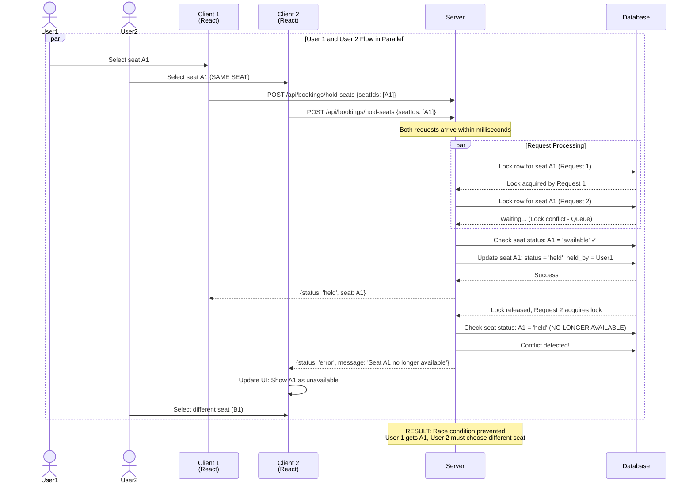
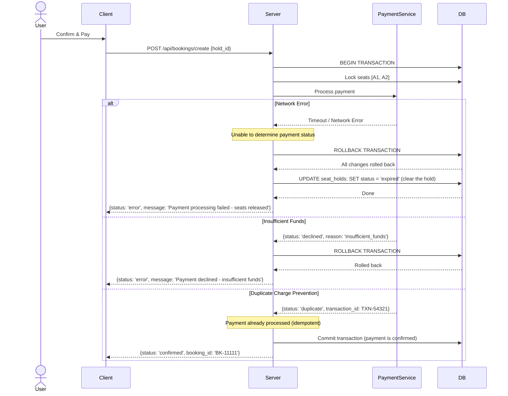

# Sequence Diagram - Event Ticketing System

## Main Flow: Complete Ticket Booking Journey

```mermaid
sequenceDiagram
    actor User
    participant Client as Frontend<br/>(React)
    participant Server as Backend<br/>(Express API)
    participant Auth as Auth<br/>Service
    participant BookingService as Booking<br/>Service
    participant PaymentService as Payment<br/>Service
    participant DB as Database<br/>(MongoDB)
    participant QRService as QR Code<br/>Service
    participant EmailService as Email<br/>Service

    Note over User,EmailService: Phase 1: User Registration & Authentication

    User->>Client: Access application
    Client->>Server: GET /api/events (public)
    Server->>DB: Find all events
    DB-->>Server: Event list
    Server-->>Client: Display events

    User->>Client: Click Register
    Client->>User: Show registration form
    User->>Client: Enter credentials (email, password, name)
    Client->>Server: POST /api/auth/register {email, password, name}
    Server->>Auth: validateInput(email, password)
    Auth-->>Server: Valid ✓
    Server->>Auth: hashPassword(password)
    Auth-->>Server: hashed_password
    Server->>DB: INSERT user {email, hashed_password, name}
    DB-->>Server: user_id: 12345
    Server->>EmailService: Send verification email
    EmailService-->>User: Verification email
    Server-->>Client: {status: 'registered', message: 'Verify your email'}
    User->>EmailService: Click verification link
    EmailService->>Server: GET /api/auth/verify?token=xyz
    Server->>DB: UPDATE user {verified: true}
    DB-->>Server: Success
    Server-->>User: Email verified ✓

    Note over User,EmailService: Phase 2: Login & Event Browsing

    User->>Client: Navigate to login
    Client->>Server: POST /api/auth/login {email, password}
    Server->>Auth: verifyPassword(password, hashed_password)
    Auth-->>Server: Valid ✓
    Server->>Auth: generateJWT({user_id, email})
    Auth-->>Server: jwt_token
    Server-->>Client: {token: jwt_token, user: {id, email, name}}
    Client->>Client: Store token in localStorage
    Note over Client: All subsequent requests include Authorization: Bearer jwt_token

    User->>Client: Browse and filter events
    Client->>Server: GET /api/events?date=2024-03-15&category=concert
    Server->>DB: Query events with filters
    DB-->>Server: Filtered events [{id, name, date, venue, available_seats}]
    Server-->>Client: Display filtered events
    User->>Client: Click on specific event

    Note over User,EmailService: Phase 3: Seat Selection & Seat Hold

    Client->>Server: GET /api/events/:eventId/seats
    Server->>DB: Query all seats for event with status
    DB-->>Server: Seats [{id, row, section, price, status: 'available'|'booked'|'held'}]
    Server-->>Client: Display interactive seating chart
    Note over Client: Frontend shows color-coded seats (green=available, gray=booked, blue=held by others)

    User->>Client: Select 2 seats (A1, A2)
    Client->>Client: Display selected seats and total price ($100)
    Client->>Server: POST /api/bookings/hold-seats {eventId, seatIds: [A1, A2], userId}
    Server->>BookingService: validateSeatAvailability(eventId, [A1, A2])
    
    par Database Read
        Server->>DB: COUNT seats WHERE event_id = eventId AND id IN [A1, A2] AND status = 'available'
        DB-->>Server: count = 2 ✓
    end
    
    BookingService->>DB: BEGIN TRANSACTION
    BookingService->>DB: LOCK ROWS (pessimistic) for selected seats
    DB-->>BookingService: Locked ✓
    
    BookingService->>DB: SELECT seats WHERE id IN [A1, A2] (version check)
    DB-->>BookingService: [{id: A1, status: available, version: 1}, {id: A2, status: available, version: 1}]
    
    BookingService->>DB: UPDATE seats SET status = 'held', held_by = user_id, held_until = NOW() + 10min WHERE id IN [A1, A2]
    DB-->>BookingService: Updated rows = 2 ✓
    
    BookingService->>DB: INSERT into seat_holds {user_id, event_id, seats: [A1, A2], created_at, expires_at}
    DB-->>BookingService: hold_id: HOLD-98765
    
    BookingService->>DB: COMMIT TRANSACTION
    DB-->>BookingService: Success
    
    Server-->>Client: {status: 'held', hold_id: 'HOLD-98765', expires_in: 600}
    Client->>Client: Start 10-minute countdown timer
    Note over Client: If timer expires, show "Hold expired - select seats again"

    Note over User,EmailService: Phase 4: Review Order

    User->>Client: Review selected seats and details
    Client->>Server: GET /api/bookings/summary {hold_id}
    Server->>DB: SELECT from seat_holds WHERE id = hold_id
    DB-->>Server: Hold details {seats, event, total_price}
    Server-->>Client: Display order summary
    Client->>Client: Show: Event name, Date, Seats (A1, A2), Price ($100), Fees ($10)

    Note over User,EmailService: Phase 5: Concurrent Payment Processing

    User->>Client: Click "Confirm & Pay"
    Client->>Server: POST /api/bookings/create {hold_id, payment_method}

    par Concurrency: Multiple users attempting payment simultaneously
        Server->>BookingService: createBooking(hold_id, user_id)
        BookingService->>DB: BEGIN TRANSACTION
        BookingService->>DB: SELECT seat_holds WHERE id = hold_id AND user_id = user_id
        DB-->>BookingService: Hold record found
        
        BookingService->>DB: LOCK ROWS for seats [A1, A2] (VERIFY still in 'held' status)
        DB-->>BookingService: Locked ✓
        
        BookingService->>DB: VERIFY: All seats still status = 'held' AND held_by = user_id
        DB-->>BookingService: Verification passed ✓
        
        BookingService->>PaymentService: processPayment(user_id, amount: $110, method)
        Note over PaymentService: Mock payment - randomly succeed/fail
        
        alt Payment Success
            PaymentService-->>BookingService: {status: 'success', transaction_id: TXN-54321}
            BookingService->>DB: INSERT into bookings {user_id, event_id, total_price, status: 'pending', created_at}
            DB-->>BookingService: booking_id: BK-11111
            
            BookingService->>DB: INSERT into booking_seats {booking_id, seat_id} x2
            DB-->>BookingService: Inserted rows = 2 ✓
            
            BookingService->>DB: UPDATE seats SET status = 'booked', booked_by = user_id WHERE id IN [A1, A2]
            DB-->>BookingService: Updated rows = 2 ✓
            
            BookingService->>DB: INSERT into payments {booking_id, amount, transaction_id, status: 'completed'}
            DB-->>BookingService: payment_id: PAY-77777
            
            BookingService->>QRService: generateQRCode({booking_id, user_id, event_id, seats: [A1, A2]})
            QRService->>QRService: Create unique QR code string
            QRService->>DB: INSERT into qr_codes {booking_id, qr_string, created_at}
            DB-->>QRService: qr_id: QR-33333
            QRService-->>BookingService: {qr_string, qr_id}
            
            BookingService->>DB: INSERT into tickets {booking_id, user_id, event_id, seat_id, qr_id, status: 'active'}
            DB-->>BookingService: Inserted rows = 2 ✓
            
            BookingService->>DB: UPDATE bookings SET status = 'confirmed' WHERE id = booking_id
            DB-->>BookingService: Updated ✓
            
            BookingService->>DB: DELETE from seat_holds WHERE id = hold_id
            DB-->>BookingService: Deleted ✓
            
            BookingService->>DB: COMMIT TRANSACTION
            DB-->>BookingService: Success ✓
            
            BookingService-->>Server: {booking_id: 'BK-11111', status: 'confirmed', qr_id: 'QR-33333'}
            
        else Payment Failed
            PaymentService-->>BookingService: {status: 'failed', reason: 'insufficient_funds'}
            BookingService->>DB: ROLLBACK TRANSACTION
            DB-->>BookingService: Rolled back ✓
            BookingService-->>Server: {status: 'error', message: 'Payment failed'}
            
        end
    end

    Server-->>Client: {status: 'confirmed', booking_id: 'BK-11111'}
    Client->>Client: Show confirmation page with order number
    Note over Client: Display: Booking ID, Event, Seats, QR code preview

    Note over User,EmailService: Phase 6: Confirmation & Ticket Generation

    Server->>EmailService: sendConfirmationEmail({user_id, booking_id, event_id, seats, qr_code})
    EmailService->>DB: SELECT user WHERE id = user_id
    DB-->>EmailService: User {email, name}
    
    EmailService->>EmailService: Generate email HTML with:
    Note over EmailService: - Event details<br/>- Seat information<br/>- Booking reference: BK-11111<br/>- QR code (embedded or as attachment)<br/>- Download ticket link<br/>- Event reminder date
    
    EmailService->>EmailService: Send email to user@example.com
    EmailService-->>User: Confirmation email received
    Note over User: Email includes: Order details, QR code, download link

    Note over User,EmailService: Phase 7: Ticket Download

    User->>Client: Click "Download Ticket" in email or app
    Client->>Server: GET /api/tickets/:ticketId/download
    Server->>Auth: verifyJWT(token)
    Auth-->>Server: Valid, user_id = 12345 ✓
    
    Server->>DB: SELECT tickets WHERE id = ticketId AND user_id = 12345
    DB-->>Server: Ticket {booking_id, event_id, seat_id, qr_id}
    
    Server->>DB: SELECT qr_codes WHERE id = qr_id
    DB-->>Server: QR code string
    
    Server->>DB: SELECT events WHERE id = event_id
    DB-->>Server: Event {name, date, time, venue, section}
    
    Server->>DB: SELECT seats WHERE id = seat_id
    DB-->>Server: Seat {row, number, section, price}
    
    Server->>Server: Generate PDF with:
    Note over Server: - Event details (name, date, time, venue)<br/>- Seat info (section A, row 1, seat 2)<br/>- QR code (encoded)<br/>- Booking reference<br/>- Security features
    
    Server-->>Client: PDF file (application/pdf)
    Client->>Client: Browser downloads: ticket_BK11111.pdf
    User->>User: Save/print ticket

    Note over User,EmailService: Phase 8: Event Day Verification (Scanning QR)

    User->>User: Arrives at venue, shows QR code
    Note over User: At venue gate/entrance
    
    Server->>Server: Event day - staff scans QR code
    Client->>Server: POST /api/tickets/:qrId/validate {qr_string}
    Server->>DB: SELECT tickets WHERE qr_id = qrId
    DB-->>Server: Ticket {booking_id, event_id, status}
    
    Server->>Server: Verify ticket NOT already scanned (status = 'active')
    alt Ticket Valid & Unscanned
        Server->>DB: UPDATE tickets SET status = 'scanned', scanned_at = NOW()
        DB-->>Server: Updated ✓
        Server-->>Client: {status: 'valid', seat: 'A1'}
        Client->>User: "✓ Valid ticket - Seat A1"
    else Ticket Already Scanned
        Server-->>Client: {status: 'error', message: 'Ticket already used'}
        Client->>User: "⚠ Ticket already scanned"
    else Ticket Invalid/Expired
        Server-->>Client: {status: 'error', message: 'Invalid ticket'}
        Client->>User: "✗ Invalid ticket"
    end

    Note over User,EmailService: Phase 9: Post-Event (Optional: Refund/Transfer)

    User->>Client: Navigate to "My Bookings"
    Client->>Server: GET /api/bookings (with authentication)
    Server->>DB: SELECT bookings WHERE user_id = 12345
    DB-->>Server: Bookings list including BK-11111
    Server-->>Client: Display booking history
    
    User->>Client: Click "Cancel Booking" (if event is in future)
    Client->>Server: POST /api/bookings/:bookingId/cancel
    
    alt Event is in future
        Server->>BookingService: calculateRefund(booking_id, cancellation_policy)
        BookingService->>DB: SELECT booking, payments WHERE booking_id = BK-11111
        DB-->>BookingService: Booking {event_date, amount_paid}
        Note over BookingService: Calculate refund: 100% if >14 days, 50% if <14 days
        BookingService-->>Server: Refund amount: $110
        
        Server->>PaymentService: processRefund(transaction_id: TXN-54321, amount: $110)
        PaymentService-->>Server: {status: 'refund_processed', refund_id: REF-88888}
        
        Server->>DB: BEGIN TRANSACTION
        Server->>DB: UPDATE bookings SET status = 'cancelled' WHERE id = BK-11111
        Server->>DB: UPDATE seats SET status = 'available' WHERE id IN [A1, A2]
        Server->>DB: DELETE from tickets WHERE booking_id = BK-11111
        Server->>DB: COMMIT
        
        Server->>EmailService: sendCancellationEmail(user_id, refund_amount, refund_id)
        EmailService-->>User: Cancellation confirmation email
        Server-->>Client: {status: 'cancelled', refund_amount: $110}
    else Event is today or in past
        Server-->>Client: {status: 'error', message: 'Cannot cancel past events'}
    end
```



---

## Alternative Flow: Concurrent Booking Conflict

### Race Condition Scenario: Two users selecting same seat



---

## Error Handling Flow: Payment Failure During Concurrent Booking



---

## Key Concurrency Mechanisms

### 1. Pessimistic Locking (During Booking)
- Database locks selected seat rows
- Prevents other transactions from reading/writing those rows
- Automatically released on transaction commit/rollback
- Ensures "last one wins" semantics

### 2. Optimistic Locking (Version Check)
- Each seat record has a version number
- Before update, verify version hasn't changed
- If changed, abort transaction and retry
- Allows concurrent reads, prevents lost updates

### 3. Atomic Operations
- Single database operation: `UPDATE seats SET ... WHERE id IN (...)`
- Prevents partial updates
- Either all seats updated or none

### 4. Transaction Isolation
- ACID properties: Atomicity, Consistency, Isolation, Durability
- Isolation level: REPEATABLE READ or SERIALIZABLE
- Ensures consistency under concurrent access

### 5. Seat Hold Expiration (TTL)
- Held seats automatically released after 10 minutes
- Uses database TTL index or scheduled background job
- Frees seats for other users if initial booker abandons

### 6. Idempotent API Design
- Multiple calls with same payment reference produce same result
- Safe retry mechanism in case of network failures
- Prevents duplicate charges

---

## Data Flow Summary

```
Registration → Authentication → Browse Events → 
Hold Seats → Review Order → Payment → 
QR Generation → Email Confirmation → 
Ticket Download → Event Validation → 
Optional: Refund/Transfer
```

This sequence ensures:
- ✓ No double-bookings
- ✓ No overselling
- ✓ Data consistency
- ✓ User experience clarity
- ✓ Proper error handling
- ✓ Audit trail for all operations
