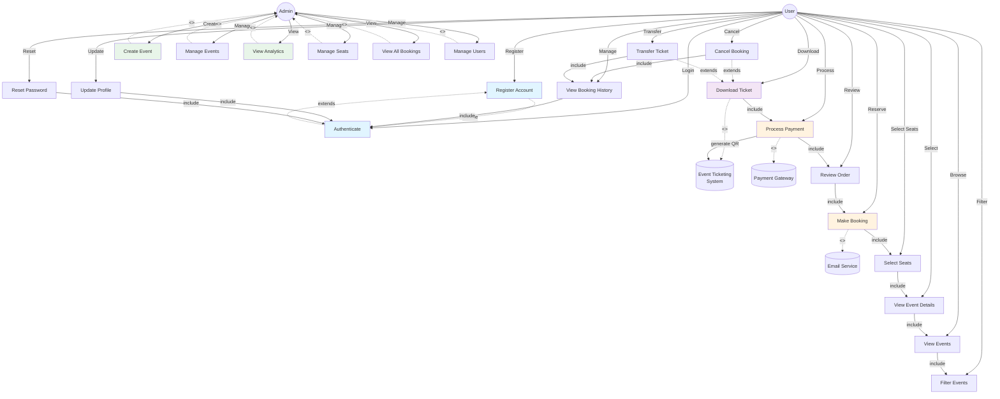

# Use Case Diagram - Event Ticketing System

## Use Case Diagram (Mermaid)



---

## Use Case Descriptions

### User Use Cases

#### UC1: Register Account
- **Actor:** User
- **Description:** New user creates an account with email and password
- **Preconditions:** User is not registered
- **Steps:**
  1. User navigates to registration page
  2. User enters email, password, and personal details
  3. System validates input
  4. System creates user account and hashes password
  5. System sends verification email
  6. User verifies email
- **Postconditions:** User account created and verified
- **Includes:** UC2 (Authenticate)

#### UC2: Authenticate
- **Actor:** User
- **Description:** User logs in with credentials to access protected features
- **Preconditions:** User has registered account
- **Steps:**
  1. User enters email and password
  2. System verifies credentials
  3. System generates JWT token
  4. System returns token to client
  5. User can access protected features
- **Postconditions:** User is authenticated with valid JWT
- **Extends:** UC1 (after registration)

#### UC3: View Events
- **Actor:** User
- **Description:** User browses available events
- **Preconditions:** User is logged in
- **Steps:**
  1. System retrieves all events from database
  2. System displays event list with details (date, venue, available seats)
  3. User views events
- **Postconditions:** Event list displayed to user
- **Includes:** UC4 (Filter Events), UC5 (View Event Details)

#### UC4: Filter Events
- **Actor:** User
- **Description:** User applies filters to find specific events
- **Preconditions:** Event list is displayed
- **Steps:**
  1. User selects filter criteria (date, category, price range, location)
  2. System filters events based on criteria
  3. System displays filtered results
- **Postconditions:** Filtered event list displayed

#### UC5: View Event Details
- **Actor:** User
- **Description:** User views detailed information about a specific event
- **Preconditions:** Event list is displayed
- **Steps:**
  1. User clicks on an event
  2. System retrieves event details
  3. System displays: description, date/time, venue, seating chart, pricing
  4. System shows real-time seat availability
- **Postconditions:** Event details page displayed

#### UC6: Select Seats
- **Actor:** User
- **Description:** User selects seats from the seating chart
- **Preconditions:** User is viewing event details
- **Steps:**
  1. System displays interactive seating chart
  2. User selects available seats
  3. System marks selected seats
  4. System calculates total price
  5. User can modify selection
- **Postconditions:** Seats selected and reserved temporarily (10-minute hold)

#### UC7: Make Booking
- **Actor:** User
- **Description:** User creates a ticket reservation
- **Preconditions:** Seats are selected
- **Steps:**
  1. User clicks "Proceed to Checkout"
  2. System creates booking record in database
  3. System acquires lock on selected seats (optimistic/pessimistic)
  4. System verifies seats still available
  5. System reserves seats with TTL
  6. System sends booking confirmation to UC8
- **Postconditions:** Booking created with status "pending"
- **Includes:** UC8 (Review Order), UC9 (Process Payment)
- **Trigger:** High concurrency handling with race condition prevention

#### UC8: Review Order
- **Actor:** User
- **Description:** User reviews booking details before payment
- **Preconditions:** Booking created
- **Steps:**
  1. System displays order summary (event, seats, total price)
  2. User reviews details
  3. User can cancel or proceed
- **Postconditions:** User confirms or cancels order

#### UC9: Process Payment
- **Actor:** User
- **Description:** User completes payment for ticket purchase
- **Preconditions:** Order reviewed and confirmed
- **Steps:**
  1. System displays payment form
  2. User enters payment details
  3. System processes payment (mock gateway)
  4. Payment gateway confirms transaction
  5. System creates ticket record
  6. System generates QR code
  7. System updates booking status to "confirmed"
  8. System sends confirmation email with ticket
- **Postconditions:** Booking confirmed, ticket created, payment processed

#### UC10: Download Ticket
- **Actor:** User
- **Description:** User downloads digital ticket as PDF/file
- **Preconditions:** Booking is confirmed
- **Steps:**
  1. User navigates to booking history
  2. User clicks "Download Ticket"
  3. System retrieves ticket and QR code
  4. System generates PDF with ticket details and QR code
  5. System sends file for download
- **Postconditions:** Ticket file downloaded successfully

#### UC11: View Booking History
- **Actor:** User
- **Description:** User views all past and upcoming bookings
- **Preconditions:** User is authenticated
- **Steps:**
  1. User navigates to "My Bookings"
  2. System retrieves all user bookings
  3. System displays booking list with details and status
  4. User can filter by status or date
- **Postconditions:** Booking history displayed

#### UC12: Cancel Booking
- **Actor:** User
- **Description:** User cancels a ticket reservation
- **Preconditions:** Booking exists and event date is in future
- **Steps:**
  1. User selects booking to cancel
  2. System calculates refund amount (based on cancellation policy)
  3. System processes refund
  4. System releases reserved seats
  5. System updates booking status to "cancelled"
  6. System sends cancellation confirmation email
- **Postconditions:** Booking cancelled, refund processed
- **Extends:** UC11 (View Booking History)

#### UC13: Transfer Ticket
- **Actor:** User
- **Description:** User transfers ticket to another registered user (optional feature)
- **Preconditions:** Booking exists and is confirmed
- **Steps:**
  1. User selects booking to transfer
  2. User enters recipient email
  3. System verifies recipient exists
  4. System creates transfer request
  5. System sends transfer notification to recipient
  6. Recipient accepts or declines transfer
  7. System updates booking ownership
- **Postconditions:** Ticket transferred to new owner
- **Extends:** UC11 (View Booking History)

#### UC14: Update Profile
- **Actor:** User
- **Description:** User updates personal profile information
- **Preconditions:** User is authenticated
- **Steps:**
  1. User navigates to profile settings
  2. User edits personal details (name, phone, address)
  3. System validates input
  4. System updates user record
  5. System sends confirmation
- **Postconditions:** Profile updated

#### UC15: Reset Password
- **Actor:** User
- **Description:** User resets forgotten password
- **Preconditions:** User is not logged in
- **Steps:**
  1. User clicks "Forgot Password"
  2. User enters email
  3. System generates reset token
  4. System sends reset email with token link
  5. User clicks link and sets new password
  6. System updates password hash
- **Postconditions:** Password reset successfully

---

### Admin Use Cases

#### UC16: Create Event
- **Actor:** Admin
- **Description:** Admin creates a new event for ticketing
- **Preconditions:** Admin is authenticated
- **Steps:**
  1. Admin navigates to event creation
  2. Admin enters event details (name, date, venue, capacity)
  3. Admin defines seat layout (sections, rows, prices)
  4. Admin sets ticket pricing tiers
  5. System creates event and seat records
  6. Admin publishes event
- **Postconditions:** Event created and available for booking

#### UC17: Manage Events
- **Actor:** Admin
- **Description:** Admin edits, views, or deletes events
- **Preconditions:** Admin is authenticated
- **Steps:**
  1. Admin views list of all events
  2. Admin can select event to edit/delete
  3. Admin updates event details
  4. System validates changes
  5. System updates event in database
- **Postconditions:** Event details updated

#### UC18: View Analytics
- **Actor:** Admin
- **Description:** Admin views booking statistics and revenue analytics
- **Preconditions:** Admin is authenticated
- **Steps:**
  1. Admin navigates to analytics dashboard
  2. System retrieves booking data aggregations
  3. System displays charts: revenue over time, occupancy rate, popular events
  4. Admin can filter by date range or event
- **Postconditions:** Analytics dashboard displayed

#### UC19: Manage Seats
- **Actor:** Admin
- **Description:** Admin configures and manages seat layouts
- **Preconditions:** Admin is authenticated
- **Steps:**
  1. Admin selects event to manage seats
  2. Admin defines seat grid (rows, columns)
  3. Admin assigns seat categories and prices
  4. Admin can block or release seats
  5. System creates seat records
- **Postconditions:** Seat configuration updated

#### UC20: View All Bookings
- **Actor:** Admin
- **Description:** Admin views all system bookings
- **Preconditions:** Admin is authenticated
- **Steps:**
  1. Admin navigates to booking management
  2. System retrieves all bookings
  3. Admin can filter by event, user, date, status
  4. Admin can view booking details
- **Postconditions:** Booking list displayed

#### UC21: Manage Users
- **Actor:** Admin
- **Description:** Admin manages user accounts
- **Preconditions:** Admin is authenticated
- **Steps:**
  1. Admin views user list
  2. Admin can search/filter users
  3. Admin can view user details, bookings, and history
  4. Admin can suspend or delete user accounts
  5. Admin can reset user passwords
- **Postconditions:** User management completed

---

## System Actors

### Primary Actors
- **User:** Regular customer who books tickets
- **Admin:** System administrator who manages events and data

### Secondary Actors
- **Email Service:** Sends confirmation and notification emails
- **Payment Gateway:** Processes ticket payments (mocked for this project)
- **Database:** Stores all application data
- **QR Code Generator:** Creates unique QR codes for tickets

---

## Critical Use Case: Make Booking (UC7)

This is the most critical use case due to concurrency challenges:

### Race Condition Scenarios Handled:

1. **Double Booking**
   - Multiple users select same seat simultaneously
   - Solution: Database-level unique constraint on (event_id, seat_id, booking_id)
   - Additionally: Optimistic locking with version numbers

2. **Overselling**
   - More users book than total seats available
   - Solution: Atomic database operation - verify count before insert

3. **Phantom Reads**
   - User sees available seats but they're booked after selection but before confirmation
   - Solution: Pessimistic locking on seat rows during reservation

4. **Lost Updates**
   - Concurrent updates to booking status
   - Solution: Version-based optimistic locking in booking update

### Implementation Strategy:

```
Booking Process Flow:
1. User selects seats → System creates temporary reservation (10-min TTL)
2. User proceeds to payment → System acquires pessimistic lock on selected seats
3. System verifies seat count: COUNT(seats) = selected count
4. System verifies seats status = 'available'
5. System atomically: INSERT booking, UPDATE seat status, INSERT tickets
6. System releases lock
7. System sends confirmation → On failure: rollback all operations
```

This ensures strict serializability under concurrent load.
